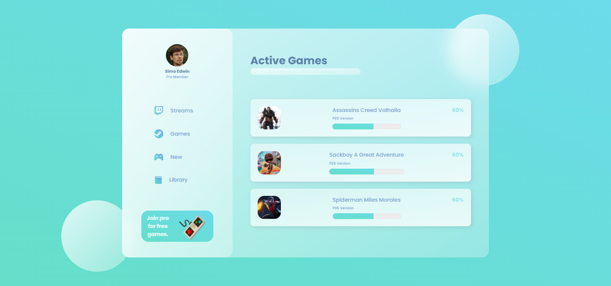

# Glass-Design-Website

# Gamer Dashboard 🎮💻

Welcome to the **Gamer Dashboard**, a sleek and visually appealing web application built with **HTML** and **CSS**, designed to give a modern glassy UI effect. The dashboard provides an immersive experience, featuring user details, game statistics, and an interactive interface with stunning visuals and animations.

## Features 🌟

- **Glassy UI Design:** The entire dashboard is built with a glassy, frosted effect, providing a smooth and modern look.
- **User Profile Section:** Displays the user's avatar, name, and membership status.
- **Dynamic Cards:** Each game card includes details such as the game version and an animated progress bar to show completion status.
- 
## Screenshots 🖼️



## Technologies Used 💻

- **HTML5:** Structured the content of the web pages with semantic markup.
- **CSS3:** Designed the layout, styling, and animations to achieve the glassmorphism effect.
- **Google Fonts (Poppins):** Added custom fonts to enhance readability and aesthetics.
- **Boxicons:** Used for adding icons in the navigation section and user profile.

## How to Run the Project 🛠️

To run the Gamer Dashboard on your local machine:

1. **Clone the repository**:
   ```bash
   git clone https://github.com/Shubiks/Glass-Design-Website.git
   ```

2. **Navigate to the project directory**:
   ```bash
   cd Glass-Design-Website
   ```

3. **Open the project**:
   You can simply open the `index.html` file in any modern web browser.

## Folder Structure 📂

```bash
.
├── assets              # Contains all images and assets
├── CSS                 # Contains the style.css file
├── index.html          # Main HTML file
└── README.md           # Project documentation (this file)
```

## Live Demo 🌐

Check out the live version of the website [here](https://your-website-link.com).

## Contributing 🤝

If you'd like to contribute to improving the project or adding new features, feel free to fork the repository and submit a pull request. Any contributions are welcome!
